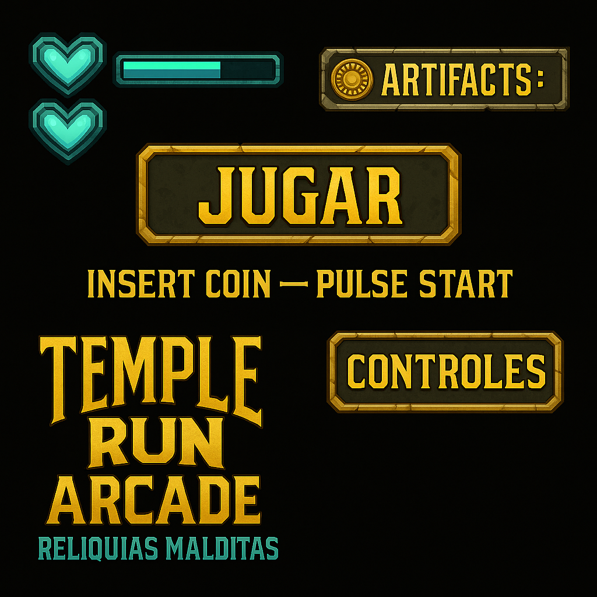

# 🗿 Temple Run Arcade: **Reliquias Malditas**

**Navegación rápida:**  
[▶ Jugar](#-jugar) · [🎮 Controles](#-controles) · [👥 Créditos](#-créditos)

---

## 💎 HUD (mockup textual)
**Vida:** 💚💚💚 | **Energía:** ███████▁▁▁ | **Artifacts:** **3/7**  
**Multiplicador:** **x1.5** | **Tiempo:** 00:45

> _INSERT COIN — PULSE START_

---

## ▶ Jugar
> _“Las ruinas despiertan... ¿Estás lista para entrar? Recoge las reliquias... antes de que el templo te devore.”_

**Objetivo del nivel**  
- Reunir **3 fragmentos** de la Máscara y **abrir el portal de salida**.

**Peligros**  
- Losas que caen, lanzas alternas, paredes móviles, curvas con poca visibilidad.

**Ayudas**  
- **Orbes de Tiempo**: ralentizan trampas por **3 s**.  
- **Talismán**: una **segunda oportunidad** si caes.  

**Puntuación**  
- Distancia + Reliquias + Perfect Runs (sin daño).  
- **Bonus** por velocidad y cadena de aciertos.

---

## 🎮 Controles
- **W / ↑** — Saltar  
- **S / ↓** — Deslizar  
- **A-D / ← →** — Esquivar  
- **Espacio** — Usar Orbe

> **Tip:** encadena acciones sin recibir daño para subir el **multiplicador**.

---

## 🗺️ Nivel 1 — Ruinas del Umbral (resumen)
- **A:** Pasillo con losas que caen (marcadas sutilmente).  
- **B:** Pared de lanzas alternas (ritmo lento → medio).  
- **C:** Curva derecha con **Orbe** opcional.  
- **Salida:** Portal **⌖** (requiere 3 fragmentos).  
- **Coleccionables:** Fragmentos **A1**, **B2**, **C3** y 1 **Llave Arcana** oculta.

---

## 👥 Créditos
**AventuraArcadeTeam**  
- **Aileen** — Líder de repositorio / Prototipo  
- **Elizabeth** — Diseño visual / Recursos  
- **Javier** — Narrativa / Documentación

---

---

© Temple Run Arcade: Reliquias Malditas
