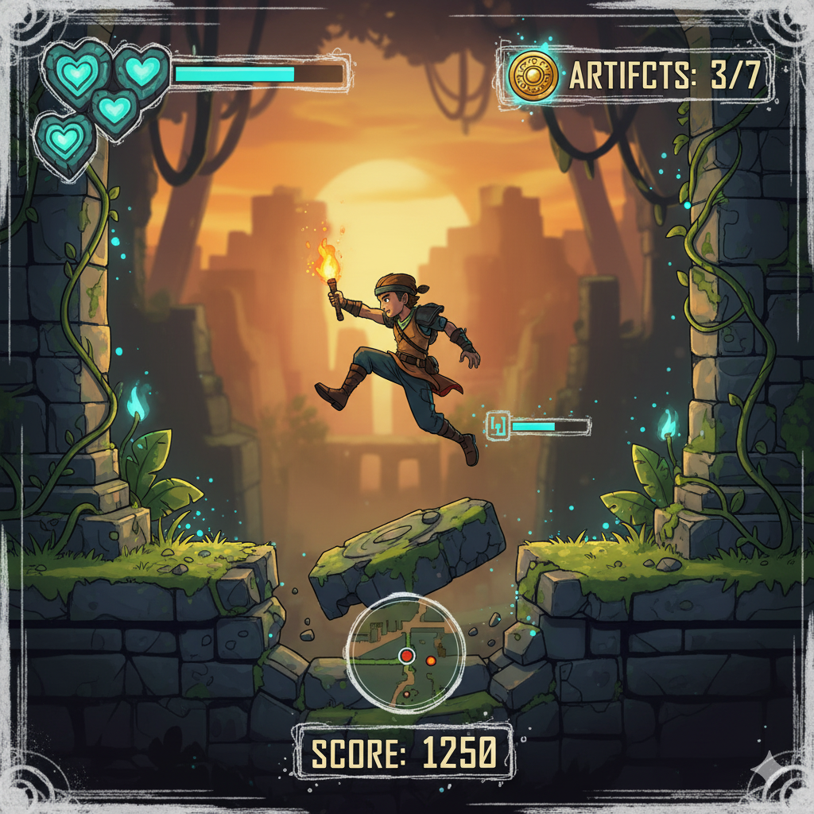
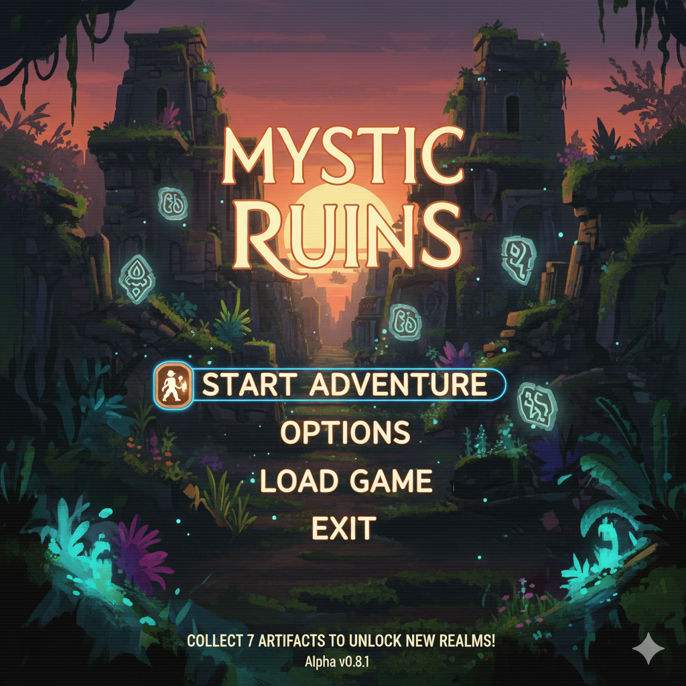
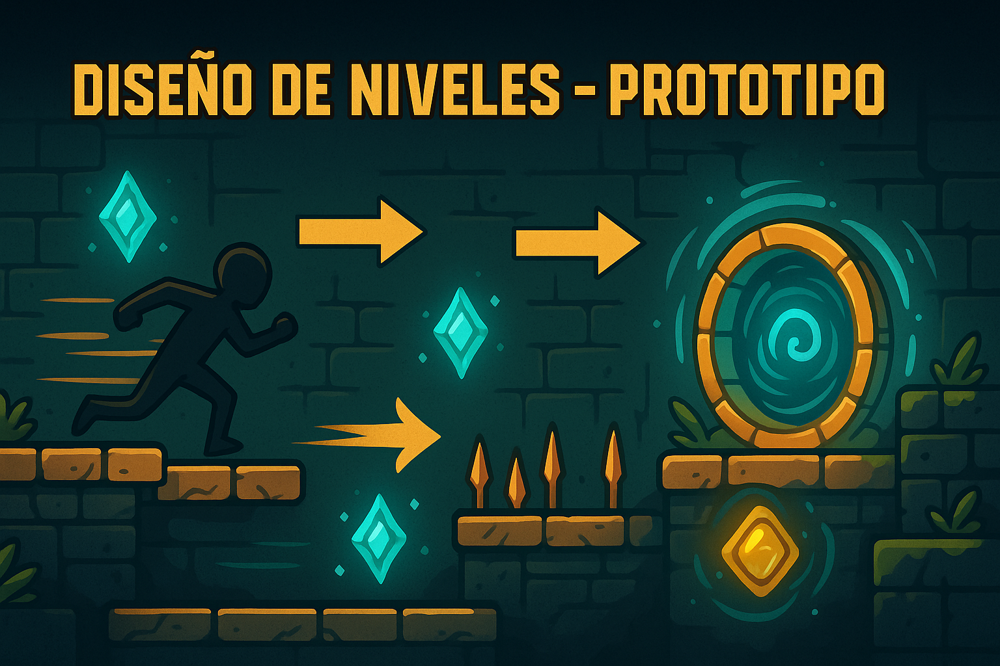

# 🗿 Temple Run Arcade: **Reliquias Malditas**

**Navegación rápida:**  
[▶ Jugar](#-jugar) · [🎮 Controles](#-controles) · [👥 Créditos](#-créditos)

---

## 💎 HUD (mockup textual)
**Vida:** 💚💚💚 | **Energía:** ███████▁▁▁ | **Artifacts:** **3/7**  
**Multiplicador:** **x1.5** | **Tiempo:** 00:45

> _INSERT COIN — PULSE START_

---

## ▶ Jugar
> _“Las ruinas despiertan... ¿Estás lista para entrar? Recoge las reliquias... antes de que el templo te devore.”_

**Objetivo del nivel**  
- Reunir **3 fragmentos** de la Máscara y **abrir el portal de salida**.

**Peligros**  
- Losas que caen, lanzas alternas, paredes móviles, curvas con poca visibilidad.

**Ayudas**  
- **Orbes de Tiempo**: ralentizan trampas por **3 s**.  
- **Talismán**: una **segunda oportunidad** si caes.  

**Puntuación**  
- Distancia + Reliquias + Perfect Runs (sin daño).  
- **Bonus** por velocidad y cadena de aciertos.

---

## 🎮 Controles
- **W / ↑** — Saltar  
- **S / ↓** — Deslizar  
- **A-D / ← →** — Esquivar  
- **Espacio** — Usar Orbe

> **Tip:** encadena acciones sin recibir daño para subir el **multiplicador**.

---

## 🗺️ Nivel 1 — Ruinas del Umbral (resumen)
- **A:** Pasillo con losas que caen (marcadas sutilmente).  
- **B:** Pared de lanzas alternas (ritmo lento → medio).  
- **C:** Curva derecha con **Orbe** opcional.  
- **Salida:** Portal **⌖** (requiere 3 fragmentos).  
- **Coleccionables:** Fragmentos **A1**, **B2**, **C3** y 1 **Llave Arcana** oculta.

---

## 👥 Créditos
**AventuraArcadeTeam**  
- **Aileen** — Líder de repositorio / Prototipo  
- **Elizabeth** — Diseño visual / Recursos  
- **Javier** — Narrativa / Documentación

---
# Temple Run Arcade: Reliquias Malditas — Historia
El eco de los tambores resuena bajo la jungla. Cuentan que un artefacto perdido, **La Máscara del Eterno Retorno**, abre portales hacia templos que cambian de forma. 
Quien reúna sus fragmentos dominará el tiempo de los templos… o quedará atrapado en su bucle maldito.
## Premisa
- Objetivo: recolectar fragmentos de la máscara para abrir el portal final.
- Amenaza: trampas antiguas, guardianes espectrales y suelos que se desmoronan.
- Progresión: cada nivel revela un símbolo de la máscara y una mecánica nueva.
## Tono arcade
Breve, intenso, rejugable. Cada run debe sentirse única, veloz y con recompensas claras.

# Mecánicas básicas
## Núcleo
- Correr, saltar, deslizar y esquivar.
- Recolectar **Fragmentos de la Máscara** (progresión de nivel).
- Llaves arcanas abren portales de salida.
## Objetos
- **Orbes de tiempo**: ralentizan trampas por 3 segundos.
- **Antorcha eterna**: revela suelos falsos por 10 segundos.
- **Talismán**: segunda oportunidad si caes.
## Puntuación
- Puntos por distancia recorrida, reliquias recolectadas y perfect runs (sin daño).
- Multiplicadores por velocidad y cadena de aciertos.
## Dificultad
- Cada nivel introduce un patrón de trampa nuevo (lanzas, pisos móviles, paredes).
- Aumenta la velocidad del scroll y reduce las zonas seguras.

  # Personajes
## Runner (Protagonista)
- Habilidad: sprint y deslizamiento (dash).
- Equipo: linterna arcana, cuerda multiusos, brújula rota que vibra cerca de reliquias.
- Meta: reunir los fragmentos y escapar antes del “reseteo” del templo.
## Guardián de Obsidiana (Antagonista)
- Aparición: aparece cuando acumulas demasiados errores o tardas mucho.
- Mecánica: persecución temporal, obliga a moverte con precisión.
## NPC — La Voz del Templo
- Función: mensajes breves (tipo tutorial arcade) y pistas crípticas.
- Humor: frases cortas estilo “Insert Coin” / “Try Again”.

# Boceto del hud
La interfaz de usuario (HUD) limpia que muestra la salud del personaje, la cantidad de artefactos recolectados y quizás un indicador de progreso o puntuación, integrados en el estilo de las ruinas.

# Boceto del mapa del primer nivel
Un mapa o vista de nivel que muestra un área de las ruinas con trampas visibles (pozos, pinchos, rocas que caen), caminos a explorar y la ubicación de algunos artefactos a recolectar.

# Boceto del menu principal
Un menú principal sencillo y evocador, con tipografía que sugiere misterio y aventura, y elementos visuales de las ruinas.

# 🗺️ DISEÑO DE NIVELES — PROTOTIPO ARCADE

**Responsable:** Aileen · 💠 Rol: Diseñadora de flujo jugable / Prototipo arcade

---

## 🎯 Propósito del sistema de niveles

El juego no tiene niveles largos, sino **"runs" cortos e intensos**. Cada nivel funciona como una **carrera de supervivencia estilo arcade**, donde:

- El jugador **entra al templo**
- Recolecta **reliquias fragmentadas**
- **El templo reacciona** y cambia (más trampas, más velocidad)
- Al obtener lo suficiente, se **activa un portal**

> _Nada se detiene. Si te quedas quieta, el templo te devora._

---

## 🧩 Estructura básica de un nivel

| Sección | Nombre | Mecánica principal | Elemento arcade |
|--------|--------|------------------|----------------|
| ✅ Entrada | **Umbral del Templo** | Introduce movimiento | Consejo arcade estilo VOZ DEL TEMPLO |
| 🔺 Zona A | **Pasaje de losas** | Pisos que caen al pisarlos | HUD suena alerta (futuro efecto) |
| 🔻 Zona B | **Corredor de lanzas** | Patrón rítmico de esquive | Marca sonora "¡NOW!" |
| 🔁 Zona C | **Curva del Eco** | Trampa dinámica (cambia ciclo) | Aparición de Orbe de Tiempo |
| 🌀 Salida | **Portal de Retorno** | Solo aparece si fragmentos = 3 | Animación tipo portal dorado |

---

## 📈 Dificultad progresiva tipo Arcade

Cada nivel aumenta en 3 aspectos:

- **Velocidad del desplazamiento**
- **Menos tiempo de reacción (HUD marca ⚠ símbolos)**
- **Más recompensas, pero más riesgo**

| Nivel | Velocidad | Trampas activas | Recompensa |
|------|:--------:|---------------|------------|
| 1 - Ruinas del Umbral | 🟢 Normal | 1 tipo de trampa | 📦 3 fragmentos |
| 2 - Santuario Caído | 🟡 Rápido | 2 trampas combinadas | 📦 5 fragmentos |
| 3 - Cámara de la Serpiente | 🔴 Muy rápido | 3 trampas aleatorias | 🌀 Portal doble / Bonus |

---

> 🎮 *Este documento sirve como guía de diseño arcade para que cada “run” tenga identidad propia. Aileen define el ritmo del juego y el impacto visual del HUD en cada sección.*

=======
# 🔮 SISTEMA DE RELIQUIAS Y PORTALES

**Responsable:** Aileen · 🌀 Diseño de mecánicas centrales

---

## 🎭 ¿Qué son las Reliquias?

- Cada nivel contiene **Fragmentos de la Máscara del Retorno**
- Para escapar, la jugadora debe **recolectar X fragmentos**
- Al recolectarlos, el **templo ruge** (se activa HUD de advertencia)
- Solo entonces aparece el **Portal de Salida**

> _“Quien no honra la reliquia… queda atrapado en el bucle eterno.”_

---

## 🎮 Mecánica Arcade del Portal

| Acción del jugador | Reacción del HUD | Estado del Templo |
|------------------|-----------------|------------------|
| Obtiene 1 fragmento | 🎧 Sonido “TICK” | Algo cambia — primera losa cae |
| Obtiene 2 fragmentos | ⚠ HUD parpadea | Trampas se aceleran |
| Obtiene fragmento final | 🔔 HUD suena “PORTAL READY” | Portal aparece con luz dorada |

---

## 🧠 Concepto de Riesgo/Recompensa

- El portal **NO aparece automáticamente delante**
- El jugador debe **decidir si explora más** (más puntos / reliquias extra)
- O si huye **rápido por el portal antes de que el templo colapse**

> _Modo Arcade: Más riesgo = mayor multiplicador. Más cobarde = sobrevives, pero sin gloria._

---

## 🎲 Posible expansión futura (Modo infinito)

- Si el jugador **ignora el portal**, el templo sigue generando secciones aleatorias
- Cada portal ignorado **incrementa el multiplicador**
- **HUD cambiaría de color** (de turquesa → rojo arcano)

---

© Temple Run Arcade: Reliquias Malditas
