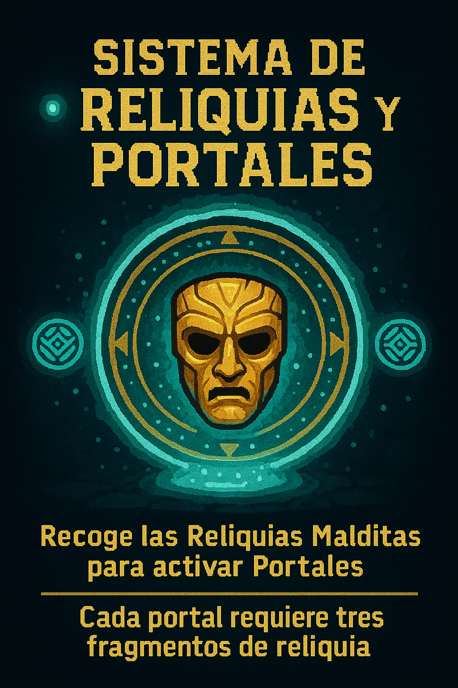

<<<<<<< HEAD
# 🔮 SISTEMA DE RELIQUIAS Y PORTALES

**Responsable:** Aileen · 🌀 Diseño de mecánicas centrales

---

## 🎭 ¿Qué son las Reliquias?

- Cada nivel contiene **Fragmentos de la Máscara del Retorno**
- Para escapar, la jugadora debe **recolectar X fragmentos**
- Al recolectarlos, el **templo ruge** (se activa HUD de advertencia)
- Solo entonces aparece el **Portal de Salida**

> _“Quien no honra la reliquia… queda atrapado en el bucle eterno.”_

---

## 🎮 Mecánica Arcade del Portal

| Acción del jugador | Reacción del HUD | Estado del Templo |
|------------------|-----------------|------------------|
| Obtiene 1 fragmento | 🎧 Sonido “TICK” | Algo cambia — primera losa cae |
| Obtiene 2 fragmentos | ⚠ HUD parpadea | Trampas se aceleran |
| Obtiene fragmento final | 🔔 HUD suena “PORTAL READY” | Portal aparece con luz dorada |

---

## 🧠 Concepto de Riesgo/Recompensa

- El portal **NO aparece automáticamente delante**
- El jugador debe **decidir si explora más** (más puntos / reliquias extra)
- O si huye **rápido por el portal antes de que el templo colapse**

> _Modo Arcade: Más riesgo = mayor multiplicador. Más cobarde = sobrevives, pero sin gloria._

---

## 🎲 Posible expansión futura (Modo infinito)

- Si el jugador **ignora el portal**, el templo sigue generando secciones aleatorias
- Cada portal ignorado **incrementa el multiplicador**
- **HUD cambiaría de color** (de turquesa → rojo arcano)
=======
# 🔮 SISTEMA DE RELIQUIAS Y PORTALES

**Responsable:** Aileen · 🌀 Diseño de mecánicas centrales

---

## 🎭 ¿Qué son las Reliquias?

- Cada nivel contiene **Fragmentos de la Máscara del Retorno**
- Para escapar, la jugadora debe **recolectar X fragmentos**
- Al recolectarlos, el **templo ruge** (se activa HUD de advertencia)
- Solo entonces aparece el **Portal de Salida**

> _“Quien no honra la reliquia… queda atrapado en el bucle eterno.”_

---

## 🎮 Mecánica Arcade del Portal

| Acción del jugador | Reacción del HUD | Estado del Templo |
|------------------|-----------------|------------------|
| Obtiene 1 fragmento | 🎧 Sonido “TICK” | Algo cambia — primera losa cae |
| Obtiene 2 fragmentos | ⚠ HUD parpadea | Trampas se aceleran |
| Obtiene fragmento final | 🔔 HUD suena “PORTAL READY” | Portal aparece con luz dorada |

---

## 🧠 Concepto de Riesgo/Recompensa

- El portal **NO aparece automáticamente delante**
- El jugador debe **decidir si explora más** (más puntos / reliquias extra)
- O si huye **rápido por el portal antes de que el templo colapse**

> _Modo Arcade: Más riesgo = mayor multiplicador. Más cobarde = sobrevives, pero sin gloria._

---

## 🎲 Posible expansión futura (Modo infinito)

- Si el jugador **ignora el portal**, el templo sigue generando secciones aleatorias
- Cada portal ignorado **incrementa el multiplicador**
- **HUD cambiaría de color** (de turquesa → rojo arcano)
>>>>>>> 7676e26b3a5fd6f724b86993c13309bd36fb670a
